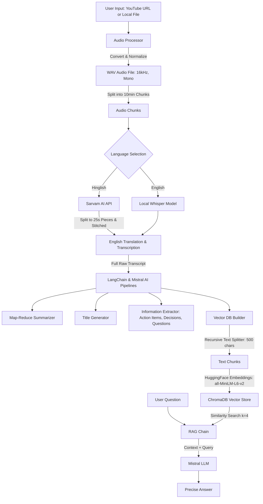

# AI Video Assistant: Comprehensive Interview Preparation Guide

This guide is structured to help you explain this project and perform exceptionally in technical interviews. It covers the project architecture, workflow, build process, implementation details, design trade-offs, and an extensive list of interview Q&As categorized by domain.

---

## 1. Project Overview & Architecture

### Executive Summary
The **AI Video Assistant** is an intelligent meeting analysis tool that takes video or audio input (either a YouTube link or a local file) and processes it to extract titles, professional summaries, key action items, decisions, and open questions. It features a **multilingual transcription engine** (handling English and Hinglish) and implements a **Retrieval-Augmented Generation (RAG) system** that lets users chat interactively with the meeting transcript using semantic search.

### System Architecture
The application is designed using a decoupled, modular pipeline pattern:



### High-Level Components
1. **Audio Ingestion Layer (`utils/audio_processor.py`)**: Downloads YouTube audio using `yt-dlp` or converts local video/audio files to a standardized format using `pydub`. It handles audio splitting (chunking) to prevent out-of-memory or API payload issues.
2. **Speech-to-Text Layer (`core/transcriber.py`)**: A dual-engine router that runs Whisper locally for standard English audio, or integrates with the Sarvam AI STT-Translate API to transcribe Hinglish code-mixed audio into English.
3. **Core LLM Orchestration (`core/summarizer.py`, `core/extractor.py`)**: Uses LangChain Expression Language (LCEL) and Mistral AI's `mistral-small-latest` model to summarize long transcripts using a Map-Reduce architecture and extract structured insights.
4. **Semantic Search & RAG Layer (`core/vector_store.py`, `core/rag_engine.py`)**: Chunks transcripts, generates vector embeddings using a local HuggingFace model (`all-MiniLM-L6-v2`), indexes them in a Chroma DB, and retrieves relevant context to answer user queries with hard source alignment constraints.
5. **Interactive UI / CLI Layer (`app.py`, `main.py`)**: Provides a web UI built in Streamlit with custom CSS (neon glassmorphism aesthetics, animated progress updates) and a CLI terminal fallback.

---

## 2. Step-by-Step Build Process

If an interviewer asks, **"How did you build this project from scratch?"**, structure your answer using these phases:

1. **Phase 1: Ingestion & Audio Prep**:
   - Integrated `yt-dlp` to fetch audio from the web.
   - Built an audio normalization pipeline using `pydub` to convert arbitrary files to `16kHz, mono, WAV` (standardizing sampling rates for speech recognition).
   - Designed a chunking mechanism to split long recordings into 10-minute blocks to handle memory constraints.
2. **Phase 2: Speech-to-Text routing**:
   - Set up local `openai-whisper` for offline English transcription.
   - Implemented an integration with the Sarvam AI API for Hinglish translation.
   - Overcame Sarvam's 30-second sync API limit by slicing 10-minute chunks into 25-second pieces, processing them, and stitching the responses together.
3. **Phase 3: Text Splitting & RAG Architecture**:
   - Set up `Chroma` vector database using LangChain.
   - Initialized `sentence-transformers` (`all-MiniLM-L6-v2`) locally to compute vector embeddings.
   - Built a retrieval pipeline fetching the top 4 most relevant chunks.
4. **Phase 4: LLM Chains (LCEL)**:
   - Configured Mistral AI API for summarization and extraction.
   - Designed a custom Map-Reduce summarization chain to summarize transcripts of arbitrary length without hitting LLM context window limits.
   - Wrote structured prompting schemas to reliably extract Action Items, Key Decisions, and Open Questions.
5. **Phase 5: User Interfaces & Styling**:
   - Created the Streamlit app with an interactive chat window.
   - Injected custom CSS to construct a modern, dark-mode developer aesthetic with live pipeline visual states.
   - Implemented `main.py` as a CLI tool for automation.

---

## 3. Core Interview Q&A (Impressive Answers)

### Category A: Architecture & General Design

#### Q1: Can you walk me through the end-to-end workflow of your AI Video Assistant?
**Answer (Impressive):**
"Certainly. The workflow begins with audio ingestion where a user submits a YouTube URL or a local media file. The application detects the source type: YouTube audio is extracted via `yt-dlp`, while local files are converted into mono, 16kHz WAV format using `pydub`. 

To process long meetings without running into hardware or payload limitations, the audio is split into 10-minute segments. These segments are routed based on language selection: English is processed locally via an `openai-whisper` model (`small`), while Hinglish audio is translated and transcribed to English using Sarvam AI's API. Because the Sarvam sync endpoint restricts uploads to 30 seconds, we programmatically slice our audio chunks into 25-second sub-pieces, transact them, and stitch the text back together.

Once the complete raw transcript is compiled, it enters parallel pipelines:
1. **Title Generation & Extraction**: The LLM (Mistral AI) generates a title, extracts action items (mapped to task, owner, and deadline), lists key decisions, and catalogs open questions.
2. **Map-Reduce Summarization**: The transcript is recursively chunked to 3,000 characters, summarized in pieces, and then combined into a structured synthesis.
3. **ChromaDB Indexing**: The transcript is chunked to 500 characters with a 50-character overlap, embedded using `all-MiniLM-L6-v2` sentence-transformers, and saved to a local Chroma vector database. 

Finally, a retrieval-augmented chain is established, enabling the user to run semantic searches and ask questions about the transcript with the context being dynamically loaded into the Mistral model."

---

#### Q2: What design patterns did you use in this system?
**Answer (Impressive):**
"I heavily relied on three primary design patterns:
1. **Pipeline Pattern**: The ingestion, conversion, chunking, transcription, indexing, and querying are built as modular, discrete steps. If I want to swap Whisper with an API-based service like Deepgram, I only need to modify the transcription module without touching the rest of the application.
2. **Strategy / Router Pattern**: The transcription component acts as a router. Depending on whether the user selects 'english' or 'hinglish', it dynamically swaps the underlying execution strategy (local CPU-bound execution vs. remote cloud API calls).
3. **Facade Pattern**: I leveraged LangChain to act as a unified facade over complex processes, such as abstracting vector indexing and retrieval (ChromaDB) and interacting with various LLMs (Mistral AI) using unified Expression Language (LCEL) chains."

---

#### Q3: Why did you choose a local embeddings model and vector store rather than cloud services?
**Answer (Impressive):**
"I chose a local embedding model (`all-MiniLM-L6-v2` via HuggingFace/SentenceTransformers) and a local database (`Chroma`) for three reasons:
- **Cost Efficiency**: Meeting transcriptions can contain thousands of words. Creating embeddings via an external API (like OpenAI's `text-embedding-3-small`) for every meeting adds API costs. Running `all-MiniLM-L6-v2` locally on CPU is fast and completely free.
- **Privacy & Security**: Keeping vector embeddings and database storage local ensures that corporate meeting data is not indexed on external third-party vector databases.
- **Latency & Simplicity**: Chroma is an in-process database (built on SQLite). Storing it locally avoids network round-trip overhead and simplifies local development and containerization."

---

### Category B: Audio Processing & Speech-to-Text

#### Q4: Why do you convert the audio files to 16kHz WAV format?
**Answer (Impressive):**
"Converting audio to a 16kHz sampling rate, single-channel (mono) WAV file is standard practice in Speech-to-Text (STT) systems. 
1. Models like Whisper and Sarvam's Saaras were trained on audio resampled to 16,000 Hz. Feeding higher sampling rates (like 44.1kHz or 48kHz) wastes bandwidth and computation, as the extra high-frequency data is discarded by the model's feature extractor.
2. Converting stereo to mono averages the channels, ensuring Whisper doesn't lose audio details from left/right panning while halving the file size and processing footprint.
3. WAV format stores uncompressed raw pulse-code modulation (PCM) data, allowing audio libraries to parse files quickly without codec overhead."

---

#### Q5: Sarvam AI has a 30-second limit for synchronous transcription. How did you handle this, and what are the trade-offs of your approach?
**Answer (Impressive):**
"Sarvam AI's speech-to-text-translate sync endpoint rejects audio files longer than 30 seconds. To solve this, I designed a chunk-splitting workflow inside `core/transcriber.py`. 
- **The Process**: I split the larger 10-minute WAV chunk into smaller pieces of 25 seconds using `pydub`. The 5-second buffer (30s limit - 25s chunk) acts as a safety margin against varying audio frame sizes. Each 25-second WAV piece is uploaded, transcribed, and then deleted from disk. Finally, the transcript segments are concatenated.
- **Trade-offs & Mitigation**: The main trade-off is **boundary loss**. If a speaker is mid-word at the 25-second mark, that word might get cut in half, leading to two misspelled or missed words at the boundary. In a production version, this could be mitigated by either using *overlapping chunks* and running a text-alignment algorithm, or utilizing an *acoustic activity detector* (VAD - Voice Activity Detection) to split the audio during silences rather than at rigid time intervals."

---

#### Q6: How do you handle Hinglish translation, and why is it important in a modern context?
**Answer (Impressive):**
"Hinglish is a code-mixed language where speakers seamlessly blend Hindi and English words. Standard English ASR (Automatic Speech Recognition) models fail on code-mixed inputs because they lack context-specific phonetic mappings. 
To address this, the pipeline routes Hinglish audio to Sarvam AI's `saaras:v2.5` speech model, which is specifically trained on Indian code-mixed speech. The model performs joint transcription and translation, outputting clean English text. This is crucial for corporate meetings in regions like India, where conversations naturally shift between English and regional dialects, ensuring no business-critical action items or decisions are lost due to language mixing."

---

### Category C: Retrieval-Augmented Generation (RAG) & Vector Database

#### Q7: Walk me through the mathematical concept of RAG and how it is implemented in this codebase.
**Answer (Impressive):**
"Retrieval-Augmented Generation optimizes LLM output by fetching authoritative information from an external source before generating the response. 
1. **Mathematical Representation**: The transcript $T$ is chunked into segments $C = \{c_1, c_2, ..., c_n\}$. Each chunk is mapped to a vector space using our embedding function $f(c_i) = \vec{v}_i \in \mathbb{R}^d$, where $d=384$ for `all-MiniLM-L6-v2`.
2. **Indexing**: The vectors $\vec{v}_i$ are stored in a hierarchical structure in ChromaDB.
3. **Retrieval**: When a query $q$ is asked, its embedding $\vec{v}_q = f(q)$ is computed. We calculate the similarity (e.g., Cosine Similarity or L2 distance) between $\vec{v}_q$ and all stored chunk embeddings $\vec{v}_i$. We retrieve the top $k$ chunks (where $k=4$ in our code):
   $$\text{Similarity}(\vec{v}_q, \vec{v}_i) = \frac{\vec{v}_q \cdot \vec{v}_i}{\|\vec{v}_q\| \|\vec{v}_i\|}$$
4. **Generation**: The retrieved chunks are formatted into a context block. The LLM processes the prompt $P = \text{System Prompt}(Context) + User Query$, grounding its answer solely in the retrieved context."

---

#### Q8: How did you select the chunk size (500 characters) and overlap (50 characters) in the vector store?
**Answer (Impressive):**
"Choosing chunk parameters involves balancing semantic coherence with information density:
- **Chunk Size (500 characters)**: For meetings, conversations change topics rapidly. If chunks are too large (e.g., 2,000 characters), a retrieved document might contain multiple unrelated topics, diluting the relevance score. A 500-character chunk roughly corresponds to 2-3 sentences, which is the sweet spot for isolating specific questions, arguments, or decisions.
- **Overlap (50 characters)**: An overlap of 10% ensures that semantic context is preserved across chunk boundaries. If a critical statement spans the boundary of Chunk A and Chunk B, the overlap ensures that the complete meaning is captured in at least one of the chunks, avoiding fractured search results."

---

#### Q9: What prompt engineering constraints did you apply to prevent hallucination in the RAG model?
**Answer (Impressive):**
"Hallucination is a primary concern in RAG pipelines. To prevent the model from fabricating facts, I implemented a strict **negative constraint** in the system prompt inside `core/rag_engine.py`:
1. **Strict Context Alignment**: *'Answer the user's question based ONLY on the meeting transcript context provided below.'*
2. **Fallback Constraint**: *'If the answer is not found in the context, say: "I could not find this information in the meeting transcript."'*
3. **Factuality Constraint**: *'Always be concise and precise. If quoting someone, mention it clearly.'*

By pairing these guidelines with a low LLM temperature of `0.3`, we restrict the model's creativity and force it to act as an extractive QA agent, rather than an imaginative generator."

---

### Category D: LLM Orchestration & LangChain

#### Q10: What is LangChain LCEL, and why did you use it instead of the standard SDK calls?
**Answer (Impressive):**
"LangChain Expression Language (LCEL) is a declarative syntax for composing chains of runnables. In my code, I used it to define pipelines like:
```python
rag_chain = (
    {"context": retriever | RunnableLambda(format_docs), "question": RunnablePassthrough()}
    | prompt
    | llm
    | StrOutputParser()
)
```
**Benefits over standard SDKs:**
- **Asynchronous & Streaming Out-of-the-Box**: LCEL chains support async operations (`ainvoke`) and streaming (`astream`) without rewriting logic.
- **Modular Composition**: It makes the input-output routing transparent. For example, the query goes through `RunnablePassthrough` unmodified, while simultaneously running through the retriever and `format_docs` function to construct the context dictionary.
- **Built-in Fallbacks & Monitoring**: LCEL allows adding fallbacks easily (e.g., if one LLM endpoint fails, automatically fallback to another model) and integrates seamlessly with tracing tools like LangSmith."

---

#### Q11: Explain your summarization architecture. Why did you use a Map-Reduce approach instead of just passing the whole transcript to Mistral?
**Answer (Impressive):**
"Meeting transcripts can be extremely long (a 1-hour meeting can yield over 10,000 words). Simply sending the entire transcript to the LLM presents two issues:
1. **Context Window Limits**: Older or smaller models cannot fit large transcripts in their context.
2. **Lost-in-the-Middle Phenomenon**: Even if a model has a large context window, LLMs tend to ignore information located in the middle of long prompts, prioritizing the beginning and the end.

To solve this, I built a **Map-Reduce** chain:
- **Map Step**: We split the transcript into smaller, manageable chunks of 3,000 characters. Each chunk is summarized independently in parallel using a simple summarization chain.
- **Reduce Step**: We concatenate all chunk summaries. We then feed this combined summary into a final LLM call that synthesizes the text into a single, cohesive, bulleted meeting overview.
This ensures high factual retention and prevents context window overflow."

---

#### Q12: Why did you set different temperatures (0.3 vs. 0.2) for the summarizer, extractor, and RAG?
**Answer (Impressive):**
"Temperature controls the randomness (creativity) of the LLM's outputs.
- **Summarizer & RAG (Temperature 0.3)**: A slightly higher temperature helps the model draft smooth, professional English prose when synthesizing multiple bullet points or answering queries, while remaining highly factual.
- **Information Extractor (Temperature 0.2)**: Extraction tasks require strict deterministic logic. When extracting Action Items or Decisions, we want zero creativity—either the deadline exists in the text or it doesn't. Setting the temperature to `0.2` ensures the model focuses entirely on precise parsing and minimizes hallucinations."

---

### Category E: Software Engineering & Production Challenges

#### Q13: If this application needs to scale to support hundreds of concurrent users, what bottlenecks do you anticipate, and how would you resolve them?
**Answer (Impressive):**
"If scaling this to a production SaaS, we would hit several bottlenecks:

1. **CPU/GPU Bottleneck in Local Transcription**: Running Whisper locally on CPU is slow and does not scale for multiple concurrent users.
   - *Resolution*: Offload transcription to an asynchronous task queue like **Celery** with **Redis**. Move Whisper to GPU nodes (using `Faster-Whisper` or Triton Inference Server) or migrate to a managed API like Deepgram or OpenAI Whisper API.
2. **Synchronous File/Network I/O in Streamlit**: Streamlit reruns the entire script on user interaction. The current code runs the processing pipeline synchronously (`process_input`, `transcribe_all`), blocking the thread.
   - *Resolution*: Implement a backend API using FastAPI. Streamlit should only make API requests. Use WebSockets or Server-Sent Events (SSE) to stream transcription progress and logs to the frontend.
3. **Database Performance**: Reading and writing Chroma vectors to disk on a single file system will cause lock conflicts under concurrency.
   - *Resolution*: Migrate from local SQLite-based Chroma to a centralized, production-grade vector database such as **pgvector (PostgreSQL)**, **Milvus**, or **Qdrant** running in a cluster."

---

#### Q14: How would you add a 'Speaker Diarization' feature to this project?
**Answer (Impressive):**
"Speaker Diarization identifies 'who spoke when'. Adding this would elevate the transcription quality from a raw block of text to an organized script.
1. **Tooling**: I would integrate an acoustic model like **PyAnnote.audio** or use a cloud API that supports diarization (e.g., AssemblyAI or Deepgram).
2. **Workflow Integration**: 
   - After converting the audio to WAV, we pass the file to PyAnnote to extract speaker segments with timestamps: `[00:15 - 00:45]: Speaker 0`, `[00:45 - 01:10]: Speaker 1`.
   - We slice the audio along these speaker boundary timestamps.
   - We pass each segment to Whisper to get the text.
   - We format the final output as:
     - **Speaker 0 (00:15):** *'Let's start the weekly sync.'*
     - **Speaker 1 (00:45):** *'Sure, I will share my screen.'*
3. **RAG Modification**: In ChromaDB, we would save the speaker name in the chunk's metadata. This allows the RAG engine to answer questions like: *'What did Speaker 1 say about the database migration?'* by applying metadata filtering."

---

#### Q15: How would you handle API rate limiting and transient network errors when calling Mistral and Sarvam AI?
**Answer (Impressive):**
"In production, third-party API calls are prone to timeouts and rate limit errors (HTTP 429). To resolve this, I would implement:
1. **Exponential Backoff with Jitter**: Use libraries like **Tenacity** in Python to wrap API calls. If a request fails, it waits for a baseline duration (e.g., 2 seconds) and retries, exponentially increasing the wait time (`2s -> 4s -> 8s`) with randomized noise (jitter) to prevent thundering herd problems.
2. **Circuit Breaker Pattern**: If an API dependency (like Mistral) is completely down, a circuit breaker goes into an 'open' state, failing immediately for a cool-down period to conserve system resources instead of continuously wasting compute on failing API requests.
3. **Fallback Models**: Configure LangChain's `.with_fallbacks()` method so that if the Mistral API fails, the pipeline automatically falls back to an alternative provider (like Anthropic Claude or a local Llama model run via Ollama)."

---

## 4. Summary of Code File Anchors
As part of your preparation, review these key files directly in the codebase:
- [app.py](file:///c:/Users/zebat/Downloads/AI-Video-Assistant--main/AI-Video-Assistant--main/app.py): Handles the Streamlit user interface, custom CSS variables, and page layouts.
- [main.py](file:///c:/Users/zebat/Downloads/AI-Video-Assistant--main/AI-Video-Assistant--main/main.py): CLI workflow entry point and RAG terminal loop.
- [utils/audio_processor.py](file:///c:/Users/zebat/Downloads/AI-Video-Assistant--main/AI-Video-Assistant--main/utils/audio_processor.py): Deals with `yt-dlp` downloading, WAV conversion via `pydub`, and audio chunking.
- [core/transcriber.py](file:///c:/Users/zebat/Downloads/AI-Video-Assistant--main/AI-Video-Assistant--main/core/transcriber.py): Manages local Whisper inference and Sarvam's API slicing workaround.
- [core/summarizer.py](file:///c:/Users/zebat/Downloads/AI-Video-Assistant--main/AI-Video-Assistant--main/core/summarizer.py): Contains the Map-Reduce pipeline configuration using Mistral AI.
- [core/extractor.py](file:///c:/Users/zebat/Downloads/AI-Video-Assistant--main/AI-Video-Assistant--main/core/extractor.py): Contains LLM extraction chains for decisions, questions, and action items.
- [core/vector_store.py](file:///c:/Users/zebat/Downloads/AI-Video-Assistant--main/AI-Video-Assistant--main/core/vector_store.py): Configures ChromaDB, text chunking, and HuggingFace embeddings (`all-MiniLM-L6-v2`).
- [core/rag_engine.py](file:///c:/Users/zebat/Downloads/AI-Video-Assistant--main/AI-Video-Assistant--main/core/rag_engine.py): Chains the vector retriever to the Mistral LLM context prompt using LCEL.
